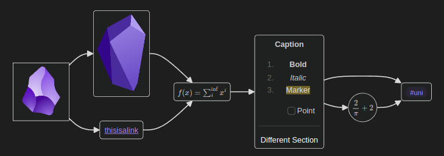
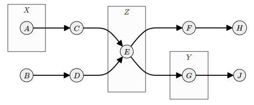

# Obsidian Mehrmaid

Mehrmaid (as in german "mehr" for "more") is an extension of Mermaid-JS codeblocks in Obsidian.
It allows rendering of Obsidian generated markdown inside of node labels.
This includes features like *Links*, *Tags*, *Codeblocks* and most importantly *Mathjax-Expressions*!

# Example

In order to render Obsidian markdown inside of mehrmaid nodes, the node content has to be wrapped in single quotes.
The following example shows how to render a graph with different node types.

````
```mehrmaid
flowchart LR
A --> B & C --> D --> E --> F & G
G --> F
A["![[logo.png|100]]"]
B("![[logo-old.png|100]]")
C("[[thisisalink]]")
D("$f(x)=\sum_i^\inf x^i$")
E("**Caption**
1. **Bold**
2. *Italic*
3. ==Marker==
- [ ] Point
---
Different Section")
F("#uni")
G(("$\dfrac{2}{\pi}+2$"))
```
````



Here is another simple example showing how to render a graph with subgraphs. 
In this example the graph is rendered in light mode.

````
```mehrmaid
flowchart LR
A --> C
B --> D
C & D --> E
E --> F & G
F --> H
G --> J
subgraph X ["$X$"]
A(("$A$"))
end
subgraph id1 ["$Y$"]
G(("$G$"))
end
subgraph id3 ["$Z$"]
E(("$E$"))
end
C(("$C$"))
D(("$D$"))
F(("$F$"))
B(("$B$"))
H(("$H$"))
J(("$J$"))
```
````




# Installation

The plugin is not yet available in the official Obsidian plugin store.
You can install it by cloning this repository into your `.obsidian/plugins` folder and then running `npm install` followed by `npm run build` inside the cloned repository.
The plugin should then be available in the Obsidian plugin settings.

# How it works

Mehrmaid makes use of the [Mermaid-JS](https://mermaid-js.github.io/mermaid/#/) library to render graphs.
Mermaid-JS allows to define nodes and edges in a graph using a simple markdown syntax.
The content of nodes can be defined using HTML or plain text.
Merhmaid works by first using the Obsidian Markdown renderer to render the content of nodes and estimate their size.
It then uses the HTML renderer of Mermaid-JS to render the graph with the correct node sizes.
Lastly the placeholder nodes are replaced with the rendered HTML.
There are still some issues with this approach, which will hopefully be fixed in the future.